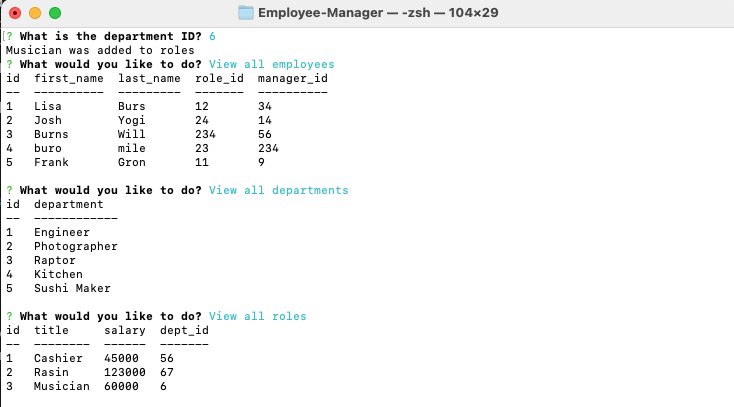

# Employee-Manager

[Repo](https://github.com/burnsgirl/Employee-Manager)   |    [Walk-Thru](https://drive.google.com/file/d/1bBjZ5Jx_Ci9zY_-TjTYh_61mewEkNry4/view?usp=sharing)

## Description
This application is used to store and update information about employees. You have the ability to add a new employee, department or role within the application. You also have the ability to view all the roles, departments, or employees you have. If you need to update a role then the function is there also. This is a command line application which has used Inquirer, Express, SQL, JaveScript, and Node.

## Table of Contents
[Installation](#installation)

[Usage](#usage)

[Technologies Used](#technologies)

[License](#license)

[Contact](#contact)

## Installation
To use this application, you will need to install Inquirer, Express, and Node. To do so you will need to run npm i in the command line. You will also need mysql run.

## Usage
This application is used to store employee information and to keep it updated when employees change different roles or new employees, departments, or roles are added.

## Technologies
Technologies used: JavaScript, Node, Inquirer, SQL, Express

## License
License: None

## Contact
Contact: DAUPHINEBURNS@GMAIL.COM
